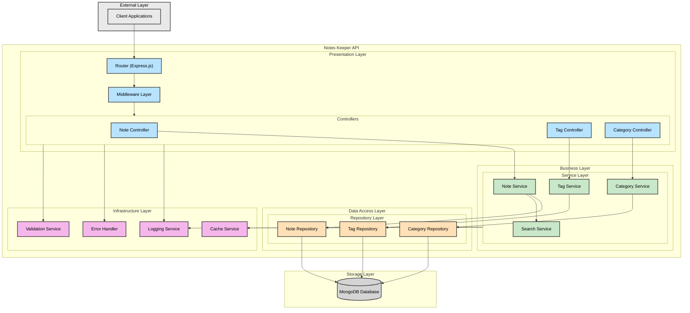
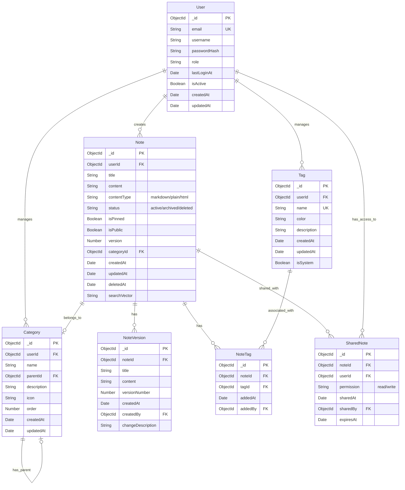
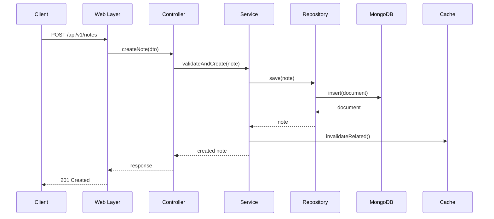

# Notes Keeper API

Notes Keeper API is a RESTful service designed for personal note management, providing developers with a robust and scalable backend for building various note-taking applications. Built with MongoDB for flexible document storage, our service combines simplicity with powerful features to help users organize and manage their thoughts effectively.

## Project Overview

### Vision Statement

We aim to create a universal and reliable note management platform that can serve as a foundation for various client applications - from simple note-taking tools to complex knowledge management systems. By leveraging MongoDB's document-oriented architecture, we provide flexible and efficient data storage that adapts to evolving user needs.

### Key Features

Our service offers a comprehensive set of capabilities for working with notes:

#### Note Management

- Create notes with rich text formatting
- Read and update existing notes
- Soft delete with recovery options
- Archive functionality
- Draft support
- Version history tracking

#### Organization and Categorization

- Flexible tagging system
- Hierarchical categories
- Note collections
- Smart filters and dynamic grouping
- Full-text search capabilities using MongoDB Atlas Search

#### Search and Filtering

- Content-based full-text search
- Advanced filtering options
- Tag and category-based queries
- Customizable sorting

### Technical Architecture

#### Data Models

##### Note Document

```javascript
{
  _id: ObjectId,
  title: String,
  content: String,
  status: String,
  tags: [{
    _id: ObjectId,
    name: String,
    color: String
  }],
  category: {
    _id: ObjectId,
    name: String
  },
  isPinned: Boolean,
  isPublic: Boolean,
  version: Number,
  metadata: {
    createdAt: ISODate,
    updatedAt: ISODate,
    deletedAt: ISODate
  }
}
```

#### System Architecture Diagrams

##### Component Architecture

Our system follows a layered architecture pattern that promotes separation of concerns and maintainability. Below is a detailed component diagram showing the relationships between different layers and modules:



The component diagram illustrates the following layers:

1. External Layer: Client applications that consume our API
2. Presentation Layer: Handles HTTP routing, middleware, and controller logic
3. Business Layer: Contains core business logic in service components
4. Data Access Layer: Manages data persistence through repositories
5. Infrastructure Layer: Provides cross-cutting concerns like logging and caching
6. Storage Layer: MongoDB database for persistent storage

##### Entity Relationship Diagram

The following diagram shows the complete data model with all entities and their relationships:



Key aspects of the data model:

1. User Management

   - Users can create and manage notes, tags, and categories
   - Support for role-based access control
   - Tracking of user activity and account status

2. Note Management

   - Rich content support with versioning
   - Flexible status management (active/archived/deleted)
   - Support for pinning and public sharing
   - Full audit trail of changes

3. Organization

   - Hierarchical categories with ordering
   - Flexible tagging system
   - Note sharing with permissions
   - Version control for note content

4. Search and Discovery
   - Full-text search capabilities
   - Tag and category-based filtering
   - Smart filters and dynamic grouping

##### Note Creation Sequence

The following sequence diagram illustrates the flow of creating a new note:



This sequence shows:

1. Request handling through the web layer
2. Data validation and processing in controllers
3. Business logic execution in services
4. Data persistence through repositories
5. Cache invalidation for consistency
6. Response formatting and delivery

#### Technology Stack

##### Core Technologies

- Runtime: Node.js 20.x
- Framework: Express.js 4.x
- Database: MongoDB 7.x
- ODM: Mongoose 8.x
- Caching: MongoDB Cache (built-in)

##### Development Tools

- Version Control: Git
- Linter: ESLint with Airbnb style guide
- Formatting: Prettier
- Testing: Jest + Supertest
- API Documentation: OpenAPI 3.0

##### Monitoring and Logging

- Logging: Winston
- Monitoring: MongoDB Atlas monitoring
- Performance: MongoDB Compass
- Tracing: OpenTelemetry

### API Endpoints

#### Notes Management

```http
POST   /api/v1/notes              # Create a new note
GET    /api/v1/notes              # Retrieve notes list
GET    /api/v1/notes/:id          # Get specific note
PUT    /api/v1/notes/:id          # Update note
DELETE /api/v1/notes/:id          # Soft delete note
PATCH  /api/v1/notes/:id/archive  # Archive note
PATCH  /api/v1/notes/:id/restore  # Restore note
GET    /api/v1/notes/search       # Full-text search in notes
```

#### Tags Management

```http
GET    /api/v1/tags               # Get tags list
POST   /api/v1/tags               # Create new tag
PUT    /api/v1/tags/:id           # Update tag
DELETE /api/v1/tags/:id           # Delete tag
GET    /api/v1/tags/:id/notes     # Get notes by tag
```

#### Categories Management

```http
GET    /api/v1/categories         # Get categories list
POST   /api/v1/categories         # Create new category
PUT    /api/v1/categories/:id     # Update category
DELETE /api/v1/categories/:id     # Delete category
```

### Architectural Principles

Our project follows these key principles:

1. Clean Architecture

   - Separation of concerns with clear layers
   - Business logic independence
   - Framework agnostic core
   - Dependency injection

2. SOLID Principles

   - Single Responsibility Principle
   - Open/Closed Principle
   - Liskov Substitution Principle
   - Interface Segregation Principle
   - Dependency Inversion Principle

3. MongoDB Best Practices

   - Proper indexing strategy
   - Efficient document schema design
   - Atomic operations usage
   - Aggregation pipeline optimization
   - Proper data modeling and embedding

4. Security
   - MongoDB authentication and authorization
   - Input sanitization
   - API rate limiting
   - Request validation
   - Secure connection strings

### Deployment

#### Environment Requirements

- Node.js 20.x or higher
- MongoDB 7.x or higher
- Docker and Docker Compose
